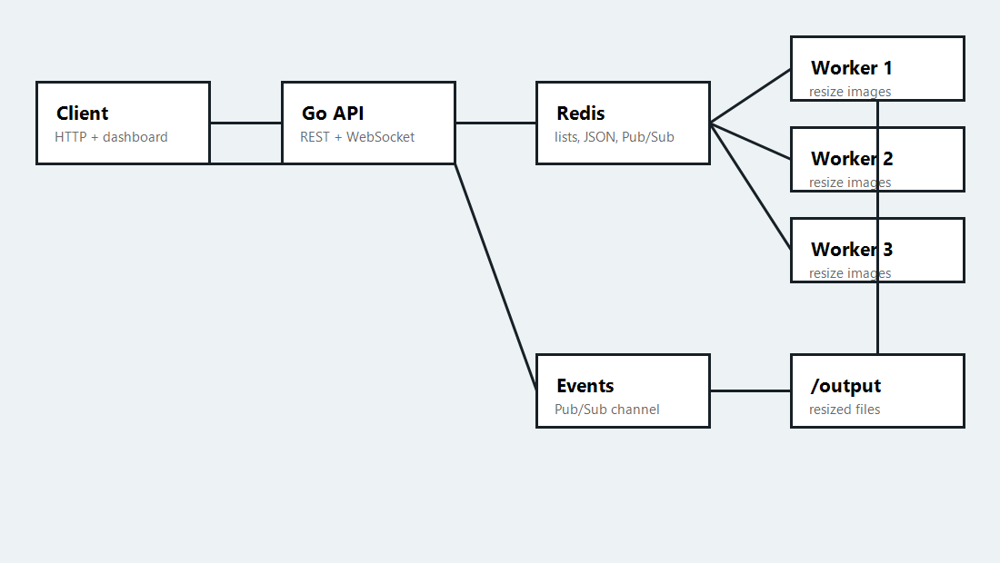

# Distributed Job Queue

A Redis-backed distributed image-resizing queue that demonstrates at-least-once delivery, horizontal workers, retries, rate limiting, live events, and visibility-timeout recovery.

## Dashboard

Run the project and open `http://localhost:8080` to see the live dashboard. A screenshot/GIF should be captured after the first local demo run and added here.

## Architecture



See `docs/architecture.md` for the editable diagram source.

```text
Client/Dashboard -> Go API -> Docker Engine -> Dynamic workers -> /output
Go API -> Redis pending/processing lists
Workers -> Redis Pub/Sub events -> API WebSocket -> Dashboard
```

## Run It Yourself

```sh
git clone <your-repo-url>
cd distributed-job-queue
docker-compose up --build
```

Then open:

```text
http://localhost:8080
```

Build the worker image once before adding workers from the dashboard:

```sh
docker-compose build worker-image
```

Workers are no longer started as static compose services. Use the dashboard's worker controls to add, kill, relaunch, and delete named workers on demand.

## How It Works

The API accepts `resize_image` jobs, stores each full job document at `job:{id}`, and pushes the job ID onto the Redis `queue:pending` list. Workers atomically move IDs from `queue:pending` to `queue:processing`, update job metadata, resize the source image into thumbnail, medium, and large outputs, and mark the job `done`.

The API also owns worker lifecycle management. `POST /workers` creates and starts a Docker container from `job-queue-worker:latest`, passing `WORKER_NAME` so the worker keeps the user-chosen identity. `POST /workers/{name}/kill` stops the container but keeps its Redis registry entry, `POST /workers/{name}/relaunch` starts that same container again, and `DELETE /workers/{name}` removes the container and registry entry. `GET /workers` returns the current registry for the dashboard.

Worker metadata is stored in the Redis hash `workers:registry`. Running and killed workers remain visible in the dashboard; deleted workers are removed from the hash and disappear.

Failures are retried up to three attempts. If a job still cannot be processed, it is moved to `queue:dead_letter` and marked `dead`. Workers publish every state change to Redis Pub/Sub so the API can forward events to dashboard clients over `/ws`.

Crash recovery uses a visibility-timeout reaper inside each worker. The reaper scans `queue:processing`; if a job has been processing longer than 30 seconds, it moves the ID back to `queue:pending` so another worker can claim it.

## Load Test Results

| Date | Requests | Concurrency | Requests/sec | Error rate | p50 latency | p95 latency |
| --- | ---: | ---: | ---: | ---: | ---: | ---: |
| Not run in this environment | 500 | 50 | TBD | TBD | TBD | TBD |

## Design Decisions

At-least-once delivery is used because Redis lists and visibility timeouts provide practical fault tolerance without pretending that a networked queue can guarantee exactly-once execution. The worker checks for already completed jobs before doing work, and output paths are deterministic by job ID, making duplicate execution safe.

The rate limiter is a Redis-backed token bucket keyed by client IP. It allows short bursts of submissions while keeping sustained request volume bounded at 5 requests per second per IP.

The visibility-timeout recovery mechanism keeps a separate `queue:processing` list. If a worker disappears while holding a job, another worker's reaper sees the stale `StartedAt` timestamp and returns the job to `queue:pending`.

The API container mounts `/var/run/docker.sock` so it can create, stop, start, and remove sibling worker containers through the Docker Engine API. This is convenient for a local demo, but it is a meaningful trust boundary: any process with access to the Docker socket effectively has administrative control over Docker on the host. Do not expose this API publicly or run untrusted code in the API container without adding stronger isolation and authorization.

Dynamic worker containers reuse the API container's Docker network and `/output` mount, so workers can reach Redis at `redis:6379` and write resized images to the same output location.
